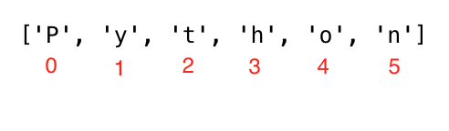

<div align="center">
  <h1> Python by Topic - Strings</h1>
  <a class="header-badge" target="_blank" href="https://www.linkedin.com/in/robbylew/">
    
  </a>

  <a class="header-badge" target="_blank" href="https://twitter.com/roberthedev">
    
  </a>

<a class="header-badge" target="_blank" href="https://robertlewis.dev">
  
</a>

<sub>Author:
<a href="https://www.linkedin.com/in/robbylew/" target="_blank">Robert Lewis</a><br>
<small> First Edition: August, 2024</small>
</sub>
</div>

# Table of Contents

1. [Creating a String](#creating-a-string)

2. [String Concatenation](#string-concatenation)

3. [Escape Sequences in Strings](#escape-sequences-in-strings)

4. [String Formatting](#string-formatting)

    - [Old Style String Formatting (`%` Operator)](#old-style-string-formatting--operator)

    - [New Style String Formatting (str.format)](#new-style-string-formatting-strformat)

    - [Newer Style String Interpolation / f-Strings](#newer-style-string-interpolation--f-strings)

5. [Python Strings as Sequences of Characters](#python-strings-as-sequences-of-characters)

    - [Unpacking Characters](#unpacking-characters)

    - [Accessing Characters in Strings by Index](#accessing-characters-in-strings-by-index)

    - [Slicing Python Strings](#slicing-python-strings)

    - [Reversing a String](#reversing-a-string)
    
    - [Skipping Characters While Slicing](#skipping-characters-while-slicing)
    
6. [String Methods](#string-methods)


# Strings

Okay lets dive into Strings. They may seem simple at first but theres quite a bit to them.

As said before, a string is a data type. Any data type written as text is a string. Also any data under a single, double, or triple quotes are strings.

**NOTE**: We can use the built-in function `len()` to check the length of a string.

## Creating a String


```python
letter = 'P'
print(letter)
print(len(letter)) 
greeting = "Hello, World"
print(greeting)
print(len(greeting))
sentence = "Strings are brilliant!"
print(sentence)
```

    P
    1
    Hello, World
    12
    Strings are brilliant!


Multiline strings are created by the use of `'''` triple single or `"""` triple double quotes.


```python
multiline_string_single = '''I am a multi
line string that is made from
triple single quotes '''

print(multiline_string_single)

print("\n") # Go to next line, so they arent on top of eachother

multiline_string_double = """I also am a
multi line string except I am made from 
double quotes!"""
print(multiline_string_double)
```

    I am a multi
    line string that is made from
    triple single quotes 
    
    
    I also am a
    multi line string except I am made from 
    double quotes!


## String Concatenation

Python allows you to combine strings. You could also call it merging, combining, connecting, whatever you prefer but all of these fall under the term concatenation.


```python
first_name = 'Robert'
last_name = 'Lewis'
space = ' '
full_name = first_name  +  space + last_name
print(full_name) # Robert Lewis
# Checking the length of a string using len() built-in function
print(len(first_name))  # 6
print(len(last_name))   # 5
print(len(first_name) > len(last_name)) # True
print(len(full_name)) # 12
```

    Robert Lewis
    6
    5
    True
    12


## Escape Sequences in Strings

If you saw earlier I sneakily used the `\n` sequence, also known as an escape sequence, which is one of the several useful escape sequences:

+ `\n`: New line
    
+ `\t`: Tab means(8 spaces)

+ `\\`: Back slash

+ `\'`: Single quote (')

+ `\"`: Double quote (")


```python
print('You best be enjoying this awesome python tutorial!') # line break
print('Days\tTopics\tBrain Growth') # adding tab space or 4 spaces 
print('Day 1\t1\t1')
print('Day 2\t2\t2')
print('Day 3\t3\t3')
print('Day 4\t1\t4')
print('This is a backslash  symbol (\\)') # To write a backslash
print('In every programming language it starts with \"Hello, World!\"') # to write a double quote inside a single quote
```

    You best be enjoying this awesome python tutorial!
    Days	Topics	Brain Growth
    Day 1	1	1
    Day 2	2	2
    Day 3	3	3
    Day 4	1	4
    This is a backslash  symbol (\)
    In every programming language it starts with "Hello, World!"


## String formatting

There are several ways of approaching this, the old way, the new way, and the newer way. lets start with the old ways.

### Old Style String Formatting (`%` Operator)

The `%` operator is used to format a set of variables enclosed in a tuple (remember from lesson 1, a fixed size list), together with a format string, which contains normal text together with "argument specifiers", special symbols like "%s", "%d", "%f", "%.number of digitsf".

+ `%s` - String (or any object with a string representation, like numbers)

+ `%d` - Integers

+ `%f` - Floating point numbers

+ `"%.number of digitsf" `- Floating point numbers with fixed precision


```python
# Strings only
first_name = 'Robert'
last_name = 'Lewis'
language = 'Python'
formated_string = 'I am %s %s. I teach %s' %(first_name, last_name, language)
print(formated_string)

# Strings  and numbers
radius = 10
pi = 3.14
area = pi * radius ** 2
formated_string = 'The area of circle with a radius %d is %.2f.' %(radius, area) # 2 refers the 2 significant digits after the point
print(formated_string)

python_libraries = ['Django', 'Flask', 'NumPy', 'Matplotlib','Pandas']
formated_string = 'The following are python libraries:%s' % (python_libraries)
print(formated_string) # "The following are python libraries:['Django', 'Flask', 'NumPy', 'Matplotlib','Pandas']"
```

    I am Robert Lewis. I teach Python
    The area of circle with a radius 10 is 314.00.
    The following are python libraries:['Django', 'Flask', 'NumPy', 'Matplotlib', 'Pandas']


### New Style String Formatting (str.format)

This formatting is introduced in Python version 3.


```python

first_name = 'Robert'
last_name = 'Lewis'
language = 'Python'
formated_string = 'I am {} {}. I teach {}'.format(first_name, last_name, language)
print(formated_string)
a = 4
b = 3

print('{} + {} = {}'.format(a, b, a + b))
print('{} - {} = {}'.format(a, b, a - b))
print('{} * {} = {}'.format(a, b, a * b))
print('{} / {} = {:.2f}'.format(a, b, a / b)) # limits it to two digits after decimal
print('{} % {} = {}'.format(a, b, a % b))
print('{} // {} = {}'.format(a, b, a // b))
print('{} ** {} = {}'.format(a, b, a ** b))

# Strings  and numbers
radius = 10
pi = 3.14
area = pi * radius ** 2
formated_string = 'The area of a circle with a radius {} is {:.2f}.'.format(radius, area) # 2 digits after decimal
print(formated_string)
```

    I am Robert Lewis. I teach Python
    4 + 3 = 7
    4 - 3 = 1
    4 * 3 = 12
    4 / 3 = 1.33
    4 % 3 = 1
    4 // 3 = 1
    4 ** 3 = 64
    The area of a circle with a radius 10 is 314.00.


### Newer Style String Interpolation / f-Strings

With Python 3.6 came f-strings. Strings start with f and we can inject the data in their corresponding positions.


```python
a = 4
b = 3
print(f'{a} + {b} = {a +b}')
print(f'{a} - {b} = {a - b}')
print(f'{a} * {b} = {a * b}')
print(f'{a} / {b} = {a / b:.2f}')
print(f'{a} % {b} = {a % b}')
print(f'{a} // {b} = {a // b}')
print(f'{a} ** {b} = {a ** b}')
```

    4 + 3 = 7
    4 - 3 = 1
    4 * 3 = 12
    4 / 3 = 1.33
    4 % 3 = 1
    4 // 3 = 1
    4 ** 3 = 64


## Python Strings as Sequences of Characters

### Unpacking Characters


```python
language = 'Python'
a,b,c,d,e,f = language # unpacking sequence characters into variables
print(a) # P
print(b) # y
print(c) # t
print(d) # h
print(e) # o
print(f) # n
```

    P
    y
    t
    h
    o
    n


### Accessing Characters in Strings by Index

In Python, and usually in programming in general, counting starts at zero.




```python
language = 'Python'
first_letter = language[0]
print(first_letter) # P
second_letter = language[1]
print(second_letter) # y
last_index = len(language) - 1
last_letter = language[last_index]
print(last_letter) # n
```

    P
    y
    n


If we want to start from right end we can use negative indexing. -1 is the last index.


```python
language = 'Python'
last_letter = language[-1]
print(last_letter) # n
second_last = language[-2]
print(second_last) # o
```

    n
    o


### Slicing Python Strings

The general Syntax is as follows, considering `arr` is a string:

+ `arr[start:stop]`         # items start through stop-1

+ `arr[start:]`            # items start through the rest of the array

+ `arr[:stop]`              # items from the beginning through stop-1

+ `arr[:]`                  # a copy of the whole array

+ `arr[start:stop:step]`    # start through not past stop, by step

You can slice strings into substrings.


```python
language = 'Python'
first_three = language[0:3] # starts at zero index and up to 3 but not include 3
print(first_three) #Pyt
last_three = language[3:6]
print(last_three) # hon
# Another way
last_three = language[-3:]
print(last_three)   # hon
last_three = language[3:]
print(last_three)   # hon
```

    Pyt
    hon
    hon
    hon


### Reversing a String

Its relatively easy to reverse a string in Python.


```python
language = 'Python'
print(language[::-1])
```

    nohtyP


### Skipping characters while slicing.

Adding the step argument `[::x]` to the slice method allows you to, as defined, step.


```python
language = 'Python'
pto = language[0:6:2] #
print(pto) # Pto
```

    Pto


## String Methods

| Function | Description |
| :-: | :-: |
| <a href="https://www.w3schools.com/python/ref_string_capitalize.asp"> `capitalize()` </a> | Converts the first character to upper case |
| <a href="https://www.w3schools.com/python/ref_string_casefold.asp"> `casefold()` </a> | Converts string into lower case |
| <a href="https://www.w3schools.com/python/ref_string_center.asp"> `center()` </a> | Returns a centered string |
| <a href="https://www.w3schools.com/python/ref_string_count.asp"> `count()` </a> | Returns the number of times a specified value occurs in a string |
| <a href="https://www.w3schools.com/python/ref_string_encode.asp"> `encode()` </a> | Returns an encoded version of the string |
| <a href="https://www.w3schools.com/python/ref_string_endswith.asp"> `endswith()` </a> | Returns true if the string ends with the specified value |
| <a href="https://www.w3schools.com/python/ref_string_expandtabs.asp"> `expandtabs()` </a> | Sets the tab size of the string |
| <a href="https://www.w3schools.com/python/ref_string_find.asp"> `find()` </a> | Searches the string for a specified value and returns the position of where it was found |
| <a href="https://www.w3schools.com/python/ref_string_format.asp"> `format()` </a> | Formats specified values in a string |
| <a href="https://www.w3schools.com/python/ref_string_format_map.asp"> `format_map()` </a> | Formats specified values in a string |
| <a href="https://www.w3schools.com/python/ref_string_index.asp"> `index()` </a> | Searches the string for a specified value and returns the position of where it was found |
| <a href="https://www.w3schools.com/python/ref_string_isalnum.asp"> `isalnum()` </a> | Returns True if all characters in the string are alphanumeric |
| <a href="https://www.w3schools.com/python/ref_string_isalpha.asp"> `isalpha()` </a> | Returns True if all characters in the string are in the alphabet |
| <a href="https://www.w3schools.com/python/ref_string_isascii.asp"> `isascii()` </a> | Returns True if all characters in the string are ascii characters |
| <a href="https://www.w3schools.com/python/ref_string_isdecimal.asp"> `isdecimal()` </a> | Returns True if all characters in the string are decimals |
| <a href="https://www.w3schools.com/python/ref_string_isdigit.asp"> `isdigit()` </a> | Returns True if all characters in the string are digits |
| <a href="https://www.w3schools.com/python/ref_string_isidentifier.asp"> `isidentifier()` </a> | Returns True if the string is an identifier |
| <a href="https://www.w3schools.com/python/ref_string_islower.asp"> `islower()` </a> | Returns True if all characters in the string are lower case |
| <a href="https://www.w3schools.com/python/ref_string_isnumeric.asp"> `isnumeric()` </a> | Returns True if all characters in the string are numeric |
| <a href="https://www.w3schools.com/python/ref_string_isprintable.asp"> `isprintable()` </a> | Returns True if all characters in the string are printable |
| <a href="https://www.w3schools.com/python/ref_string_isspace.asp"> `isspace()` </a> | Returns True if all characters in the string are whitespaces |
| <a href="https://www.w3schools.com/python/ref_string_istitle.asp"> `istitle()` </a> | Returns True if the string follows the rules of a title |
| <a href="https://www.w3schools.com/python/ref_string_isupper.asp"> `isupper()` </a> | Returns True if all characters in the string are upper case |
| <a href="https://www.w3schools.com/python/ref_string_join.asp"> `join()` </a> | Converts the elements of an iterable into a string |
| <a href="https://www.w3schools.com/python/ref_string_ljust.asp"> `ljust()` </a> | Returns a left justified version of the string |
| <a href="https://www.w3schools.com/python/ref_string_lower.asp"> `lower()` </a> | Converts a string into lower case |
| <a href="https://www.w3schools.com/python/ref_string_lstrip.asp"> `lstrip()` </a> | Returns a left trim version of the string |
| <a href="https://www.w3schools.com/python/ref_string_maketrans.asp"> `maketrans()` </a> | Returns a translation table to be used in translations |
| <a href="https://www.w3schools.com/python/ref_string_partition.asp"> `partition()` </a> | Returns a tuple where the string is parted into three parts |
| <a href="https://www.w3schools.com/python/ref_string_replace.asp"> `replace()` </a> | Returns a string where a specified value is replaced with a specified value |
| <a href="https://www.w3schools.com/python/ref_string_rfind.asp"> `rfind()` </a> | Searches the string for a specified value and returns the last position of where it was found |
| <a href="https://www.w3schools.com/python/ref_string_rindex.asp"> `rindex()` </a> | Searches the string for a specified value and returns the last position of where it was found |
| <a href="https://www.w3schools.com/python/ref_string_rjust.asp"> `rjust()` </a> | Returns a right justified version of the string |
| <a href="https://www.w3schools.com/python/ref_string_rpartition.asp"> `rpartition()` </a> | Returns a tuple where the string is parted into three parts |
| <a href="https://www.w3schools.com/python/ref_string_rsplit.asp"> `rsplit()` </a> | Splits the string at the specified separator, and returns a list |
| <a href="https://www.w3schools.com/python/ref_string_rstrip.asp"> `rstrip()` </a> | Returns a right trim version of the string |
| <a href="https://www.w3schools.com/python/ref_string_split.asp"> `split()` </a> | Splits the string at the specified separator, and returns a list |
| <a href="https://www.w3schools.com/python/ref_string_splitlines.asp"> `splitlines()` </a> | Splits the string at line breaks and returns a list |
| <a href="https://www.w3schools.com/python/ref_string_startswith.asp"> `startswith()` </a> | Returns true if the string starts with the specified value |
| <a href="https://www.w3schools.com/python/ref_string_strip.asp"> `strip()` </a> | Returns a trimmed version of the string |
| <a href="https://www.w3schools.com/python/ref_string_swapcase.asp"> `swapcase()` </a> | Swaps cases, lower case becomes upper case and vice versa |
| <a href="https://www.w3schools.com/python/ref_string_title.asp"> `title()` </a> | Converts the first character of each word to upper case |
| <a href="https://www.w3schools.com/python/ref_string_translate.asp"> `translate()` </a> | Returns a translated string |
| <a href="https://www.w3schools.com/python/ref_string_upper.asp"> `upper()` </a> | Converts a string into upper case |
| <a href="https://www.w3schools.com/python/ref_string_zfill.asp"> `zfill()` </a> | Fills the string with a specified number of 0 values at the beginning |

